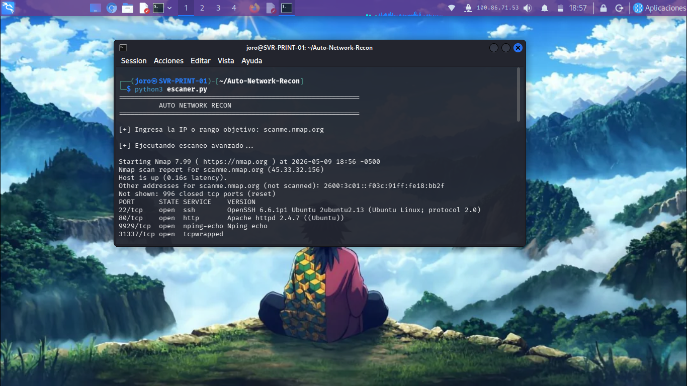

# Auto-Network-Recon

## Descripción

Auto-Network-Recon es una herramienta desarrollada en Python para automatizar procesos básicos de reconocimiento y enumeración de servicios en entornos de laboratorio controlados.

El proyecto integra capacidades de escaneo avanzado con Nmap, generación automatizada de reportes y análisis estructurado de resultados utilizando parsing XML.

Su objetivo principal es optimizar tareas repetitivas de reconocimiento técnico y mejorar la organización de información durante procesos iniciales de análisis de red.

---

# Características

- Escaneo TCP SYN automatizado
- Detección de versiones de servicios
- Identificación básica de sistema operativo
- Exportación de resultados en TXT y XML
- Parsing automatizado de servicios detectados
- Generación estructurada de reportes
- Flujo integrado de reconocimiento y análisis
- Automatización de tareas repetitivas

---

# Tecnologías Utilizadas

- Python 3
- Nmap
- XML Parsing
- Linux (Kali Linux)
- Bash
- Git & GitHub

---

# Arquitectura del Flujo

La herramienta fue diseñada siguiendo un enfoque modular orientado a automatización y análisis técnico.

## Flujo General

1. El usuario define un objetivo de red.
2. Se ejecuta un escaneo avanzado mediante Nmap.
3. Los resultados se almacenan automáticamente en formatos TXT y XML.
4. El sistema procesa el XML generado.
5. Se extraen y organizan servicios, versiones y metadatos relevantes.
6. La información se presenta de manera estructurada para facilitar análisis posteriores.

---

# Capacidades Técnicas

- Enumeración automatizada de servicios
- Detección de versiones y banners
- Parsing XML utilizando Python
- Organización estructurada de resultados
- Automatización de reconocimiento inicial
- Integración entre Linux, Python y Nmap
- Procesamiento automatizado de información técnica

---

# Ejecución

## Clonar repositorio

```bash
git clone https://github.com/felipegonza548/Auto-Network-Recon.git
cd Auto-Network-Recon
```

## Ejecutar herramienta

```bash
python3 escaner.py
```

---

# Evidencias

## Escaneo avanzado automatizado



---

## Parsing automático de servicios


---

## Estructura del proyecto


---

# Ejemplo de Salida

```text
[+] Puerto: 22
    Servicio : ssh
    Producto : OpenSSH
    Version  : 6.6.1p1 Ubuntu

[+] Puerto: 80
    Servicio : http
    Producto : Apache httpd
    Version  : 2.4.7
```

---

# Objetivos del Proyecto

Este proyecto fue desarrollado con fines educativos y de fortalecimiento técnico en áreas relacionadas con:

- Automatización
- Reconocimiento de red
- Análisis técnico
- Linux
- Parsing de datos
- Ciberseguridad defensiva
- Documentación técnica

---

# Mejoras Futuras

- Exportación JSON
- Dashboard visual de resultados
- Integración con APIs
- Generación automática de reportes HTML
- Soporte para múltiples objetivos
- Historial de escaneos
- Visualización gráfica de servicios

---

# Disclaimer

Este proyecto fue desarrollado únicamente con fines educativos y de automatización dentro de entornos controlados y autorizados.

El uso indebido de esta herramienta es responsabilidad exclusiva del usuario.

---

# Autor

Luis Felipe Gonzalez Pemberty

Técnico en Ciberseguridad | Linux | Networking | Automatización | Python
